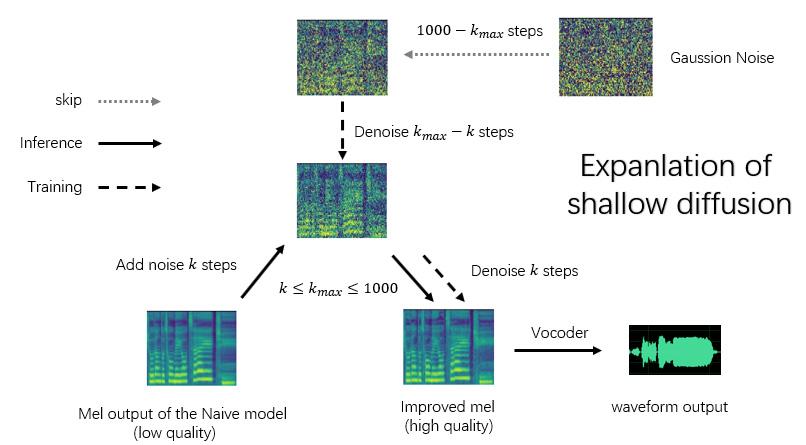

Language: [简体中文](./README.md) **English**

**This English readme will not update first time, please read [简体中文](./README.md) for latest info。**

I am not good at English. If there are any errors, please point them out.

# Diffusion-SVC
[](https://colab.research.google.com/github/CNChTu/Diffusion-SVC/blob/main/Diffusion_SVC_EN.ipynb)
[](https://github.com/CNChTu/Diffusion-SVC/)
[](https://discord.gg/jvA5c2xzSE)

This repository is a separate storage for the diffusion part of the [DDSP-SVC](https://github.com/yxlllc/DDSP-SVC) repository. It can be trained and inferred independently.
***
**Recent update: The use of the naive model and the shallow Diffusion model of the warehouse can achieve better results than the simple Diffusion model with extremely low training costs, which is strongly recommended.**
<br>Samples and introductions can be found in [[Introduction Video(Not done yet)]]()


## 0. Introduction
Diffusion-SVC is a separate storage for the diffusion part of the [DDSP-SVC](https://github.com/yxlllc/DDSP-SVC) repository. It can be trained and inferred independently.

Compared with the well-known [Diff-SVC](https://github.com/prophesier/diff-svc), this project consumes much less graphic memory, has faster training and inference speed, and is specially optimized for shallow diffusion and real-time use. It can perform real-time inference on a powerful GPU.By combining with the Naive model of this project for shallow diffusion, even weaker GPUs can generate high-quality audio in real-time.

If the quality of the training data and the input source are both very high, Diffusion-SVC may have the best conversion effect.

This project can easily cascade shallow diffusion after other Acoustic model to improve the final output effect or reduce the performance occupancy. For example, cascading Diffusion SVC after the **Naive model** of this project or [DDSP SVC](https://github.com/yxlllc/DDSP-SVC) can further reduce the required diffusion steps and obtain high-quality output.

In addition, this project can also train the number of noise reduction steps required for shallow diffusion without training the complete noise reduction process starting from Gaussian noise, which can improve the training speed and quality. See the following for more information.

Disclaimer: Please ensure to only use **legally obtained authorized data** to train the Diffusion-SVC model, and do not use these models and any audio synthesized by them for illegal purposes. The author of this library is not responsible for any infringements, scams, and other illegal acts caused by the use of these model checkpoints and audio.

## 1. Install dependencies
1. Install PyTorch: We recommend first downloading PyTorch from the **[PyTorch official website](https://pytorch.org/)**, then run:
```bash
pip install -r requirements.txt 
```

## 2. Configure the requirement model
- **(Required)** Download the pretrained [ContentVec](https://ibm.ent.box.com/s/z1wgl1stco8ffooyatzdwsqn2psd9lrr) encoder and place it in the `pretrain` folder. [Cropped ContentVec images](https://huggingface.co/ChiTu/Diffusion-SVC/resolve/main/checkpoint_best_legacy_500.pt) has the same effect, but only 190MB.
  - Note: You can also use other feature extractors, but ContentVec is still highly recommended. All supported feature extractors can be found in the `Units_Encoder` class in `tools/tools.py`.
- **(Required)** Download the pretrained vocoder from the [DiffSinger community vocoder project](https://openvpi.github.io/vocoders) and unzip it to the `pretrain/` folder.
  -  Note: You should download the compressed file with `nsf_hifigan` in its name, not `nsf_hifigan_finetune`.
- ~~If you need to use the voiceprint model, you need to set `use_speaker_encoder` in the configuration file to `true`, and download the pretrained voiceprint model from [here](https://drive.google.com/drive/folders/15oeBYf6Qn1edONkVLXe82MzdIi3O_9m3?usp=sharing). This model comes from [mozilla/TTS](https://github.com/mozilla/TTS/wiki/Released-Models).~~

## 3. Preprocessing

### 1. Setting up Training and Validation Datasets

#### 1.1 Manual Configuration:

Place all training set data (.wav format audio clips) in the `data/train/audio` folder, or in a directory specified in the configuration file such as `xxxx/yyyy/audio`.

Place all validation set data (.wav format audio clips) in the `data/val/audio` folder, or in a directory specified in the configuration file such as `aaaa/bbbb/audio`.

#### ~~1.2 Random Selection by Program (Not Implemented):~~

~~Run `python draw.py`. The program will help you select validation set data (you can adjust parameters such as the number of files to be extracted in `draw.py`).~~

#### 1.3 Folder Structure Directory Display:
**Note: Speaker IDs must start from 1, not 0; if there is only one speaker, this speaker's ID must be 1.**
- Directory Structure:

```
data
├─ train
│    ├─ audio
│    │    ├─ 1
│    │    │   ├─ aaa.wav
│    │    │   ├─ bbb.wav
│    │    │   └─ ....wav
│    │    ├─ 2
│    │    │   ├─ ccc.wav
│    │    │   ├─ ddd.wav
│    │    │   └─ ....wav
│    │    └─ ...
|
├─ val
|    ├─ audio
│    │    ├─ 1
│    │    │   ├─ eee.wav
│    │    │   ├─ fff.wav
│    │    │   └─ ....wav
│    │    ├─ 2
│    │    │   ├─ ggg.wav
│    │    │   ├─ hhh.wav
│    │    │   └─ ....wav
│    │    └─ ...
```

#### 2. Start Preprocessing
```bash
python preprocess.py -c configs/config.yaml
```
You can modify the configuration file `configs/config.yaml` before preprocessing.

#### 3. Notes:
1. Please ensure that the sampling rate of all audio clips matches the sampling rate specified in the yaml configuration file! (If pre processing such as resampling is required, it is recommended to use [fap](https://github.com/fishaudio/audio-preprocess))

2. Cutting long audio into smaller clips can speed up training, but the duration of all audio clips should not be less than 2 seconds. If there are too many audio clips, you will need more memory. Setting the `cache_all_data` option in the configuration file to false can solve this problem.

3. It is suggested that the total number of audio clips in the validation set be about 10, don't put too many, otherwise the validation process will be slow.

4. If your dataset quality is not very high, please set the 'f0_extractor' in the configuration file to 'crepe'. The crepe algorithm has the best noise resistance, but it will significantly increase the time required for data preprocessing.

5. The ‘n_spk’ parameter in the configuration file will control whether to train a multi-speaker model. If you want to train a **multi-speaker** model, to number the speakers, all audio folder names must be **integers no larger than ‘n_spk’**.

## 4. Training

### 1. Training without pre-trained model:
```bash
python train.py -c configs/config.yaml
```

### 2. Pre-trained Models:
**We strongly recommend fine-tuning with pre-trained models, which is easier and much more time-saving than training from scratch, and can achieve a higher limit than small datasets.**

**Please note, fine-tuning on a base model requires using the same encoder as the base model, such as ContentVec, the same applies to other encoders (like voiceprint), and the model's network size and other parameters should be the same.**

****
**！！！！！！Recommend training Shallow Diffusion Model and Naive Model！！！！！！<br>The combination of shallow Diffusion model that only train k_step_max depth and Naive model may have higher quality and faster training speed than pure full diffusion model**
****

### 2.1 训练完整过程的扩散预训练模型
| Units Encoder                                                                                                                                               | Network size | Datasets                                   | Model                                                                                               |
|-------------------------------------------------------------------------------------------------------------------------------------------------------------|--------------|--------------------------------------------|-----------------------------------------------------------------------------------------------------|
| [contentvec768l12(推荐)](https://ibm.ent.box.com/s/z1wgl1stco8ffooyatzdwsqn2psd9lrr)                                                                          | 512*20       | VCTK<br/>m4singer                          | [HuggingFace](https://huggingface.co/ChiTu/Diffusion-SVC/resolve/main/v0.1/contentvec768l12.7z)     |
| [hubertsoft](https://github.com/bshall/hubert/releases/download/v0.1/hubert-soft-0d54a1f4.pt)                                                               | 512*20       | VCTK<br/>m4singer                          | [HuggingFace](https://huggingface.co/ChiTu/Diffusion-SVC/resolve/main/v0.1/hubertsoft.7z)           |
| [whisper-ppg(仅支持sovits)](https://openaipublic.azureedge.net/main/whisper/models/345ae4da62f9b3d59415adc60127b97c714f32e89e936602e85993674d08dcb1/medium.pt) | 512*20       | VCTK<br/>m4singer<br/>opencpop<br/>kiritan | [HuggingFace](https://huggingface.co/Kakaru/sovits-whisper-pretrain/blob/main/diffusion/model_0.pt) |

Here is an additional special pre-trained model using the contentvec768l12 encoder, the dataset is `m4singer`/`opencpop`/`vctk`. It is not recommended to use this and there's no guarantee it won't cause problems: [Download](https://huggingface.co/ChiTu/Diffusion-SVC/resolve/main/v0.1/contentvec768l12%2Bmakefunny.7z).

### 2.2 Pre training Diffusion model that only trains k_step_max depth; and supporting Naive model 
| Units Encoder                                                                  | Network size | k_step_max | Datasets          | Shallow Diffusion Model                                                                                                                       | Naive Model                                                                                                                          |
|--------------------------------------------------------------------------------|--------------|------------|-------------------|-----------------------------------------------------------------------------------------------------------------------------------------------|--------------------------------------------------------------------------------------------------------------------------------------|
| [contentvec768l12](https://ibm.ent.box.com/s/z1wgl1stco8ffooyatzdwsqn2psd9lrr) | 512*30       | 100        | VCTK<br/>m4singer | [HuggingFace](https://huggingface.co/datasets/ms903/Diff-SVC-refactor-pre-trained-model/resolve/main/Diffusion-SVC/shallow_512_30/model_0.pt) | [HuggingFace](https://huggingface.co/datasets/ms903/Diff-SVC-refactor-pre-trained-model/resolve/main/Diffusion-SVC/naive/model_0.pt) |
| [contentvec768l12](https://ibm.ent.box.com/s/z1wgl1stco8ffooyatzdwsqn2psd9lrr) | 512*20       | 200        | VCTK<br/>m4singer | [HuggingFace](https://huggingface.co/datasets/ms903/Diff-SVC-refactor-pre-trained-model/resolve/main/Diffusion-SVC/shallow_512_20/model_0.pt) | [HuggingFace](https://huggingface.co/datasets/ms903/Diff-SVC-refactor-pre-trained-model/resolve/main/Diffusion-SVC/naive/model_0.pt) |

**The pre training naive model can also be used for the previous naive model of the complete Diffusion model. And when fine-tuning the Shallow model, it is recommended to include the`decay_step`  in the configuration (such as 20000).**

### 3. Training with Pretrained Models:
1. We welcome pull requests for multi-speaker pretrained models (please use datasets that are authorized for open-source training).
2. The pretrained models are mentioned above. Please note that the model must use the same encoder.
3. Place the pretrained model named `model_0.pt` in the model export folder specified by the "expdir: exp/*****" parameter in `config.yaml`. If the folder doesn't exist, create a new one. The program will automatically load the pretrained model from this folder.
4. Start training just like training without pretrained model.

## 4.1. Naive model and Combo model
### Naive model
The naive model is a lightweight svc model, which can be used as a precursor to shallow diffusion. The training method is consistent with the Diffusion model. The example configuration file is located in `configs/config_naive.yaml`。The pretreatment required is the same as the Diffusion model.
```bash
python train.py -c configs/config_naive.yaml
```
When reasoning, use`-nmodel`to point to the model file for use, and in this case, shallow diffusion depth `-kstep` must be used.

### Combo model
Use `combo.py` to combine a Diffusion model and a naive model into a combo model. Only this model can achieve shallow diffusion. These two models need to be trained with the same parameters (like the speaker ID), as they also use the same parameters for inference.
```bash
python combo.py -model <model> -nmodel <nmodel> -exp <exp> -n <name>
```
Use the above command to combine two models. Where `-model` is the path of the Diffusion model, and `-nmodel` is the path of the naive model；The config files in the same directory as the model will also be automatically read。`-exp`is the directory for outputting composite models，`-n` is the name of the saved composite model。The above command will output the combined model as `<name>.ptc` under`<exp>`.

The combined model can be directly loaded as a Diffusion model for shallow diffusion during reasoning, without the need to input `-nmodel` to load the naive model.

## 4.2. About k_step_max and Shallow diffusion
***(Schematic diagram at the beginning of readme)***

In the shallow diffusion process, the Diffusion model only starts from a certain noise depth, and does not need to start from Gaussian noise. Therefore, the Diffusion model for shallow diffusion can only train a certain noise depth without starting from Gaussian noise.

Specify in Configuration File `k_step_max` refers to the depth of diffusion, which is the training process. The value must be less than 1000 (which is the number of steps for complete diffusion). The model trained in this way cannot be inferred separately, and shallow diffusion must be carried out on the output results or input sources of the previous model; The maximum depth of diffusion cannot exceed `k_step_max`.

Sample config can be found in`configs/config_shallow.yaml`。

It is recommended to combine this shallow only Diffusion model with the naive model as a combo model.

## 5. Visualization
```bash
# Use tensorboard to check the training status
tensorboard --logdir=exp
```
After the first validation, you can see the synthesized test audio in TensorBoard.

## 6. Offline Inference
```bash
python main.py -i <input.wav> -model <model_ckpt.pt> -o <output.wav> -k <keychange> -id <speaker_id> -speedup <speedup> -method <method> -kstep <kstep> -nmodel <nmodel>
```
`-model` is the model path, `-k` is the pitch shift, `-speedup` is the speedup multiplier, `-method` is `pndm`,`ddim`,`unipc` or `dpm-solver`, `-kstep` is the shallow diffusion step, `-id` is the speaker ID of the diffusion model.

If `-kstep` is not empty, shallow diffusion will be performed on the input source mel, if `-kstep` is empty, full depth Gaussian diffusion will be performed.

 `-nmodel`(Optional, requires separate training) is the path of the Naive model, used for shallow diffusion of k depth based on the initial output, and its parameters need to be matched with the main model.

~~If voiceprint encoding was used, an external voiceprint can be specified with `-spkemb`, or the model's voiceprint dictionary can be overwritten with `-spkembdict`.~~

## 7. Units Index(Optional,Not Recommended)
Like [RVC](https://github.com/RVC-Project/Retrieval-based-Voice-Conversion-WebUI) and [so-vits-svc](https://github.com/svc-develop-team/so-vits-svc).

**Note that this is an optional feature and can be inferred normally without use.Indexing takes up a large amount of storage space and also consumes a lot of CPU during indexin.**
```bash
# training index，preprocessing needs to be completed first
python train_units_index.py -c config.yaml
```
When reasoning, use the '- lr' parameter. This parameter is the retrieval ratio.

## 8. Real time inference
It is recommended to use the built-in GUI of this warehouse for real-time inference. If shallow diffusion is needed, please first combine the models.
```bash
python gui_realtime.py
```

This project can also be coordinated with[rtvc](https://github.com/fishaudio/realtime-vc-gui)Implement real-time inference.

**Note: Currently flask_api is an experimental feature and RTVC is not yet fully developed, so it is not recommended to use this method.**

```bash
pip install rtvc
python rtvc
python flask_api.py
```

## 9. Compatibility
### 9.1. Units Encoder
|                               | Diffusion-SVC | [DDSP-SVC](https://github.com/yxlllc/DDSP-SVC) | [so-vits-svc](https://github.com/svc-develop-team/so-vits-svc) |
|-------------------------------|---------------|------------------------------------------------|----------------------------------------------------------------|
| ContentVec                    | √             | √                                              | √                                                              |
| HubertSoft                    | √             | √                                              | √                                                              |
| Hubert(Base,Large)            | √             | √                                              | ×                                                              |
| CNHubert(Base,Large)          | √             | √                                              | √*                                                             |
| CNHubertSoft                  | √             | √                                              | ×                                                              |
| Wav2Vec2-xlsr-53-espeak-cv-ft | √*            | ×                                              | ×                                                              |
| DPHubert                      | ×             | ×                                              | √                                                              |
| Whisper-PPG                   | ×             | ×                                              | √*                                                             |
| WavLM(Base,Large)             | ×             | ×                                              | √*                                                             |

## 10. Colab
You can use `Diffusion_SVC_EN.ipynb` written by [TheMandateOfRock](https://github.com/OOPPEENN); As I do not have a conditional test, please provide feedback to the note author regarding any issues.~~(我摸了)~~

## 11.Onnx export
Create a new folder under the exp folder(the name of the folder is ProjectName in the following command), place the model and configuration files in it, rename the model file to model.pt, rename the config file to config.yaml

然后执行以下命令
```shell
python diffusion/onnx_export.py --project <ProjectName>
```
After the export is completed, a configuration file for [MoeVS](https://github.com/NaruseMioShirakana/MoeVoiceStudio) will be automatically created. Thank you to [NaruseMioShirakana](https://github.com/NaruseMioShirakana)(also the author of MoeVS) for providing onnx export support.

## Acknowledgement
* [DDSP-SVC](https://github.com/yxlllc/DDSP-SVC)
* [soft-vc](https://github.com/bshall/soft-vc)
* [diff-SVC](https://github.com/prophesier/diff-SVC)
* [DiffSinger (OpenVPI version)](https://github.com/openvpi/DiffSinger)

## Thank you to all contributors for their efforts
<a href="https://github.com/CNChTu/Diffusion-SVC/graphs/contributors">
  
</a>
